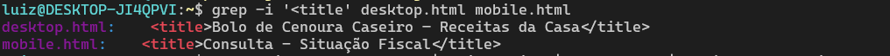
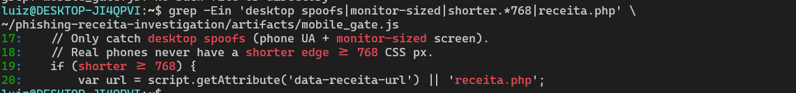
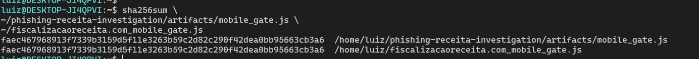

# Investigação de campanha de phishing

Case técnico de análise defensiva, OSINT e correlação de infraestrutura envolvendo uma campanha de phishing que se passa pela Receita Federal brasileira.

A investigação começou após a análise de um link recebido por WhatsApp que direcionava usuários móveis para uma falsa consulta de situação fiscal, enquanto acessos realizados por desktop recebiam uma página inofensiva de receita de bolo.

O objetivo deste repositório é documentar a metodologia utilizada, os indicadores encontrados e as relações observadas entre diferentes domínios associados ao mesmo conjunto de artefatos.

> Este projeto tem finalidade exclusivamente educacional e defensiva.  
> Nenhuma exploração de vulnerabilidades, tentativa de acesso não autorizado, brute force ou comprometimento de infraestrutura foi realizada.

---

## Resumo do caso

O domínio inicialmente analisado foi:

```text
analiseteibutarista.com
```

O comportamento observado era diferente dependendo do dispositivo utilizado.

## Documentação

- [Timeline da investigação](timeline.md)
- [Indicadores de comprometimento](iocs/iocs.csv)
- [Artefatos públicos](artifacts/)
- [Hashes SHA-256](evidence/hashes/SHA256SUMS.txt)

### Desktop

O servidor retornava uma página aparentemente legítima e inofensiva:

```text
Bolo de Cenoura Caseiro – Receitas da Casa
```

### Mobile

O mesmo domínio retornava uma página imitando uma consulta de situação fiscal do governo brasileiro:

```text
Consulta - Situação Fiscal
```

A página solicitava CPF e posteriormente apresentava uma suposta intimação fiscal.

Durante a investigação foi possível identificar:

- cloaking baseado no tipo de dispositivo;
- mecanismo adicional de anti-analysis;
- falsa página de consulta fiscal;
- coleta e utilização de CPF;
- enriquecimento do conteúdo com nome da vítima;
- chat automatizado simulando atendimento da Receita Federal;
- mensagens de urgência e ameaça de bloqueio financeiro;
- geração de cobrança PIX;
- monitoramento automático do status da transação;
- reutilização dos mesmos artefatos em diversos outros domínios.

---

## Fluxo observado

O fluxo reconstruído durante a análise foi:

```text
WhatsApp / link direcionado
        |
        v
analiseteibutarista.com
        |
        +-----------------------------+
        |                             |
        v                             v
     Desktop                        Mobile
        |                             |
        v                             v
Página de receita             Falsa página gov.br
de bolo                       / situação fiscal
                                      |
                                      v
                              resultado/index.php
                                      |
                                      v
                           Suposta intimação fiscal
                                      |
                                      v
                                   /chat/
                                      |
                                      v
                         Chat automatizado falso
                                      |
                                      v
                              /pix/criar.php
                                      |
                                      v
                           Código PIX / QR Code
                                      |
                                      v
                         Monitoramento de pagamento
```

---

## Cloaking e anti-analysis

Um dos principais achados foi a diferença de conteúdo entregue pelo servidor dependendo do cliente.

Os headers HTTP observados incluíam:

```text
Accept-CH: Sec-CH-UA-Mobile, Sec-CH-UA-Platform, Sec-CH-UA-Model
Vary: User-Agent, Sec-CH-UA-Mobile
```

Isso indica que o servidor diferencia respostas com base em informações relacionadas ao navegador e ao dispositivo.

Foi realizada uma comparação entre respostas simulando desktop e mobile.

Resultado:

```text
desktop.html
<title>Bolo de Cenoura Caseiro – Receitas da Casa</title>
```

```text
mobile.html
<title>Consulta - Situação Fiscal</title>
```

Os arquivos possuíam conteúdo diferente já na resposta HTTP.

---

## mobile_gate.js

A página destinada a dispositivos móveis também carregava:

```text
/assets/js/mobile_gate.js
```

O script realizava uma segunda verificação utilizando as dimensões reais da tela:

```javascript
var w = window.screen && screen.width ? screen.width : 0;
var h = window.screen && screen.height ? screen.height : 0;

var shorter = Math.min(w, h);

if (shorter >= 768) {
    var url = script.getAttribute('data-receita-url') || 'receita.php';
    location.replace(url);
}
```

O próprio arquivo continha comentários indicando a intenção de detectar análise feita por desktop utilizando User-Agent mobile:

```javascript
// Only catch desktop spoofs (phone UA + monitor-sized screen).
// Real phones never have a shorter edge >= 768 CSS px.
```

Assim, o mecanismo observado era aproximadamente:

```text
User-Agent mobile
       |
       v
Página falsa carregada
       |
       v
mobile_gate.js
       |
       v
Verifica tamanho real da tela
       |
       +--------------------------+
       |                          |
   tela mobile                 tela desktop
       |                          |
       v                          v
mantém phishing            receita.php
                                  |
                                  v
                           página de bolo
```

---

## Página falsa de situação fiscal

A página mobile continha elementos que simulavam uma autenticação/consulta gov.br.

O formulário enviava o CPF utilizando:

```text
resultado/index.php
```

com parâmetros semelhantes a:

```text
cpf=
cpf_clean=
```

Mesmo utilizando um CPF claramente inválido durante a análise, o servidor retornou:

```text
IRREGULAR
```

e apresentou uma suposta intimação fiscal.

Para CPFs sem dados associados, a página utilizava:

```text
Nome não informado
```

Isso demonstrou que a indicação de irregularidade não dependia necessariamente de uma situação fiscal real.

---

## Engenharia social

A página apresentava diversas mensagens destinadas a gerar urgência e medo.

Entre elas:

```text
Intimação fiscal - Receita Federal do Brasil
```

```text
Impossibilidade de movimentar PIX, TED e DOC
```

```text
multa adicional no valor de R$ 1.985,00
```

Também foi identificado um suposto chat de regularização utilizando a personagem:

```text
Tereza Alencar
```

apresentada como:

```text
Auditora da Receita Federal do Brasil
```

O chat era completamente automatizado por JavaScript.

Algumas das mensagens encontradas incluíam:

```text
desconto de 67%
```

e:

```text
Autorizo o bloqueio do meu CPF
```

---

## Fluxo de pagamento PIX

O chat possuía um fluxo de geração de pagamento.

O frontend enviava um `POST` JSON para:

```text
/pix/criar.php
```

com informações como:

```json
{
  "name": "",
  "email": "",
  "cpf": "",
  "phone": "",
  "parcelasSelecionadas": [],
  "quantidadeParcelas": 0,
  "valorTotal": ""
}
```

A resposta esperada incluía campos semelhantes a:

```text
pixCode
pix_code
pixQrCode
pix_qr_code
id
transaction_id
```

O QR Code era posteriormente gerado no navegador.

### Monitoramento da transação

Após a criação da cobrança, o código monitorava o pagamento através de:

```text
/pix/detalhes.php?id=<transactionId>
```

A consulta era executada periodicamente.

Os status tratados incluíam:

```text
approved
paid
processing
```

Também foi encontrado outro endpoint:

```text
/pix/status.php?transactionId=<transactionId>
```

utilizado em um fluxo de verificação manual.

Nenhuma cobrança PIX foi criada durante esta investigação.

---

## Infraestrutura inicial

Durante a coleta foram observados os seguintes dados.

### Domínio

```text
analiseteibutarista.com
```

### IPv4 observado

```text
185.190.143.246
```

### Provedor / ASN

```text
Contabo GmbH
AS51167
```

### Servidor HTTP

```text
nginx/1.18.0 (Ubuntu)
```

### Registrar

```text
Tucows Domains Inc.
```

### Nameservers

```text
1-you.njalla.no
2-can.njalla.in
3-get.njalla.fo
```

### DNS TXT

Durante a coleta também foi observado:

```text
google-site-verification=...
```

O valor completo pode ser mantido nos artefatos de evidência, caso necessário para correlação.

---

## TLS e certificado

O servidor utilizava certificado Let's Encrypt.

Durante a análise foram coletadas informações como:

```text
issuer
subject
notBefore
notAfter
serial
```

Esses dados foram armazenados separadamente como evidência.

---

## Descoberta de cluster no URLScan

Um recurso associado à campanha foi pesquisado pelo SHA-256 no URLScan.

A busca retornou:

```text
33 scans
```

associados ao mesmo hash.

Entre os domínios observados estavam:

```text
controlefiscalbr.com
regularizafiscalbr.com
regularizapendencia.com
fiscalcerto.com
fiscalizacaoreceita.com
ordemtributos.com
regularidadepessoal.com
acertatributos.com
acertoguiadeclara.com
atividaderegular.com
fiscalregulariza.com
acessorestricaofiscal.com
conformidadeemdia.com
fiscalcontrole.com
tributosconformes.com
fiscalconforme.com
controledadosfiscal.com
regularizetributos.com
conformidadetributos.com
conformidaderegular.com
segurocartorio.com
```

A correspondência de hash indica reutilização do mesmo recurso.

Isso, isoladamente, não prova que todos os domínios pertençam ao mesmo operador.

---

## Correlação com fiscalizacaoreceita.com

Um dos domínios encontrados apresentou uma relação particularmente forte com o domínio originalmente analisado:

```text
fiscalizacaoreceita.com
```

Foi possível verificar:

- mesmo `mobile_gate.js`;
- SHA-256 idêntico do arquivo;
- mesmos comentários no código;
- mesmo mecanismo de anti-analysis;
- mesma personagem `Tereza Alencar`;
- mesma multa de `R$ 1.985,00`;
- mesmo desconto de `67%`;
- mesma opção `Autorizo o bloqueio do meu CPF`;
- mesmo fluxo de pagamento PIX;
- mesmos endpoints;
- mesmo registrar;
- mesmos nameservers da Njalla;
- hospedagem associada à Contabo / AS51167.

O arquivo:

```text
/assets/js/mobile_gate.js
```

apresentou o mesmo SHA-256 nos dois domínios:

```text
faec467968913f7339b3159d5f11e3263b59c2d82c290f42dea0bb95663cb3a6
```

Os endpoints encontrados também apresentaram a mesma estrutura:

```text
/
receita.php
chat/
resultado/index.php
pix/criar.php
pix/detalhes.php
pix/status.php
assets/js/mobile_gate.js
```

Essa combinação fornece forte evidência de reutilização da mesma base de phishing.

Entretanto:

> A investigação não atribui os domínios a uma pessoa ou grupo específico.

O mesmo kit pode ser utilizado por mais de um operador.

---

## Evidências visuais

### Conteúdo diferente entre desktop e mobile

O mesmo domínio retornava títulos diferentes dependendo do cliente utilizado:

```text
Desktop → Bolo de Cenoura Caseiro – Receitas da Casa
Mobile  → Consulta - Situação Fiscal
```



### Mecanismo anti-analysis

O arquivo `mobile_gate.js` verifica o tamanho real da tela para identificar acessos que utilizam User-Agent mobile em um computador.



### Correlação entre campanhas

O `mobile_gate.js` coletado de `analiseteibutarista.com` e o arquivo encontrado em `fiscalizacaoreceita.com` apresentaram o mesmo SHA-256:

```text
faec467968913f7339b3159d5f11e3263b59c2d82c290f42dea0bb95663cb3a6
```



---

## Indicadores de Comprometimento

Alguns IOCs identificados durante a análise:

```text
analiseteibutarista.com
185.190.143.246
fiscalizacaoreceita.com
searchapi.dnnl.live
```

O domínio:

```text
searchapi.dnnl.live
```

foi encontrado em comentário presente no código:

```javascript
// Fluxo usa nova API https://searchapi.dnnl.live para consulta de CPF.
```

No momento da análise, tanto:

```text
searchapi.dnnl.live
```

quanto:

```text
dnnl.live
```

retornavam:

```text
NXDOMAIN
```

Por isso este indicador é tratado como possível infraestrutura histórica ou desativada.

---

## Metodologia

A investigação utilizou principalmente:

- `dig`
- `nslookup`
- `whois`
- `curl`
- `openssl`
- `grep`
- `sed`
- `diff`
- `sha256sum`
- URLScan
- consultas públicas de DNS e WHOIS
- análise estática de HTML e JavaScript

Não foram utilizados:

- brute force;
- exploração de vulnerabilidades;
- tentativa de acesso administrativo;
- varredura agressiva de portas;
- enumeração de CPFs;
- criação intencional de cobrança PIX;
- tentativa de comprometimento da infraestrutura.

---

## Preservação de evidências

Os artefatos foram coletados e armazenados separadamente.

Exemplos:

```text
desktop.html
mobile.html
mobile_gate.js
receita.html
chat.html
resultado_teste.html
```

Também foram preservados:

```text
DNS
WHOIS
headers HTTP
certificado TLS
diff desktop/mobile
hashes SHA-256
consultas de infraestrutura
```

Os artefatos originais foram armazenados em pacote separado e não são necessariamente disponibilizados integralmente neste repositório.

A versão pública contém apenas dados considerados apropriados para divulgação.

---

## Estrutura planejada do repositório

```text
phishing-receita-investigation/
│
├── README.md
│
├── evidence/
│   ├── dns/
│   ├── whois/
│   ├── tls/
│   ├── headers/
│   └── hashes/
│
├── artifacts/
│   ├── mobile_gate.js
│   ├── diff_desktop_mobile.txt
│   └── sanitized_samples/
│
├── iocs/
│   └── iocs.csv
│
├── screenshots/
│
└── timeline.md
```

---

## Limitações

Esta análise possui algumas limitações importantes.

A correlação técnica entre diferentes domínios não deve ser interpretada automaticamente como atribuição de autoria.

Indicadores como:

- mesmo template;
- mesmo JavaScript;
- mesmo servidor;
- mesmo ASN;
- mesmo registrar;
- mesmos nameservers;

podem ser compartilhados por diferentes operadores.

Por isso, as conclusões deste projeto são limitadas à relação técnica entre os artefatos observados.

---

## Objetivo educacional

Este projeto foi desenvolvido como exercício prático de:

- Blue Team;
- SOC Analysis;
- Threat Intelligence;
- OSINT;
- análise de phishing;
- análise de infraestrutura;
- preservação de evidências;
- correlação de IOCs;
- análise de HTML/JavaScript.

O foco é demonstrar uma metodologia de investigação defensiva reproduzível utilizando ferramentas amplamente disponíveis.

---

## Disclaimer

Este repositório é destinado exclusivamente a pesquisa, educação e defesa.

Nenhuma informação aqui apresentada deve ser utilizada para:

- acessar sistemas sem autorização;
- explorar vulnerabilidades;
- cometer fraude;
- obter dados pessoais;
- gerar cobranças;
- interromper serviços.

Dados pessoais de vítimas, CPFs reais, credenciais, tokens, chaves PIX e outros elementos sensíveis não são publicados.
